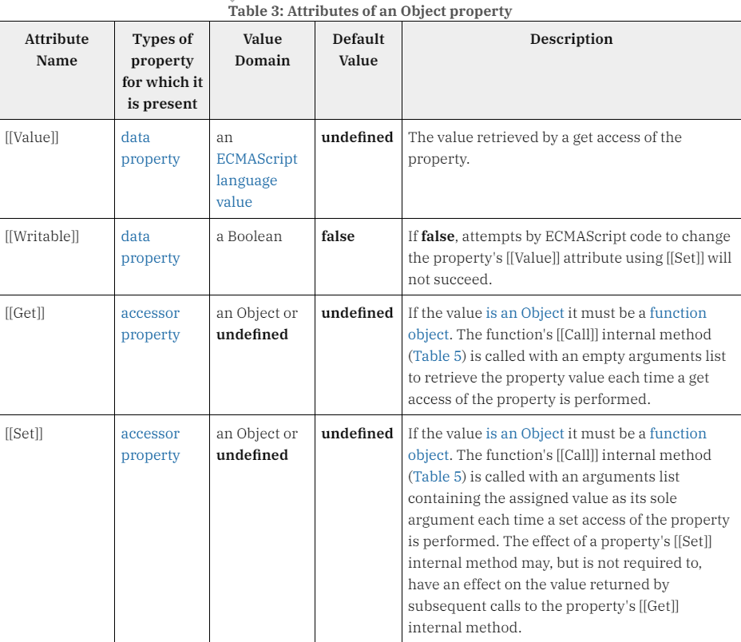
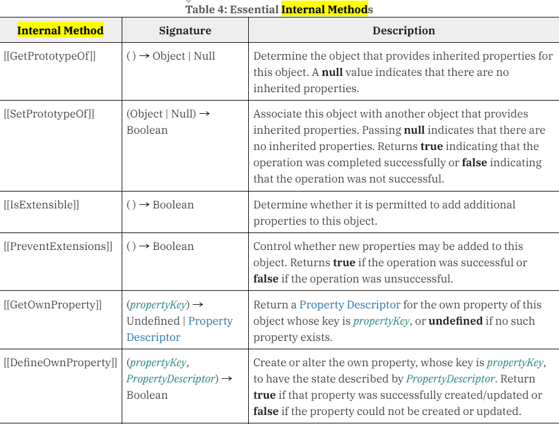

## 16. 프로퍼티 어트리뷰트

- JavaScript의 내부 슬롯(internal slot)과 내부 메서드(internal method)는 각각 **의사 프로퍼티(pseudo property)**, **의사 메서드(pseudo method)**라고 불리며

- 내부 슬롯과 내부 메서드는 JavaScript 엔진의 구현 알고리즘을 설명하기 위해 사용되며 실제 개발에서는 자주 사용되지 않는다([[Prototype]], '_ _ proto_ _' 접근자 프로퍼티 말고는 잘 사용하지 않는다.)

- ECMAScript 표준에서 이중 대괄호('[[]]')로 감싼 명칭들이 보통 내부 슬롯과 내부 메서드에 해당한다.

> 참고 자료

> [링크](https://tc39.es/ecma262/)

#### 내부 슬롯


#### 내부 메서드


## 17. 생성자 함수에 의한 객체 생성

### 17-1 Object 생성자 함수
- **`생성자 함수(constructor)`** : new 연산자와 함께 호출하여 객체(인스턴스/instance ⇒ 메모리에 할당된 상태)를 생성하는 함수
⇒ 생성자 함수에 의해 생성된 객체를 ***인스턴스***라 부른다.

- new 연산자와 함께 Object 생성자 함수를 호출하면 빈 객체를 생성하여 반환한다.
    
    ```javascript
    // 빈 객체 생성
    const emptyObj = new Object();
    
    // 프로퍼티 추가
    emptyObj.name = 'Jung';
    emptyObj.sayHello = function () {
    	console.log('Hi! My name is ' + this.name);
    }
    
    console.log(emptyObj); // { name: 'Jung', sayHello: [Function (anonymous)] }
    emptyObj.sayHello(); // Hi! My name is Jung
    ```
    
- Object 생성자 함수 이외에도 String, Number, Boolean, Function, Array, Date, RegExp, Promise 등의 내장 생성자 함수(built-in constructor)를 제공한다.
### 17-2 생성자 함수

- **객체 리터럴에 의한 객체 생성 방식의 단점: 한 번에 하나의 객체만 생성할 수 있다.**

- 객체는 프로퍼티를 통해 객체 고유의 상태(state)를 표현한다.

- 객체 메서드를 통해 프로퍼티를 참조하고 조작하는 동작을 표현한다.

- 프로퍼티는 객체마다 프로퍼티 값이 다를 수 있지만 메서드는 내용이 동일한 경우가 많다.

- 생성자 함수에 의한 객체 생성 방식의 장점: 클래스(class)처럼 프로퍼티 구조가 동일한 객체 여러 개를 간편하게 생성할 수 있다.

- new 연산자가 없이 생성자 함수를 호출하면 일반 함수처럼 동작한다.
    
    ```javascript
    // 생성자 함수
    function Circle(radius) {
    	// 생성자 함수 내부의 this는 생성자 함수가 생성할 인스턴스를 가리킨다.
    	this.radius = radius;
    	this.getDiameter = function () {
    		return 2 * this.radius;
    	};
    }
    
    // 인스턴스의 생성
    const circle1 = new Circle(5); // 반지름이 5인 Circle 객체를 생성
    const circle2 = new Circle(10); // 반지름이 10인 Circle 객체를 생성
    
    console.log(circle1.getDiameter()); // 10
    console.log(circle2.getDiameter()); // 20
    
    // new 연산자가 없이 호출하면 일반 함수로 취급된다.
    const circle3 = Circle(15);
    
    // 일반 함수로 호출된 Circle 함수의 this는 전역 객체를 가리킨다.
    console.log(circle3); // undefined
    console.log(radius); // 15
    ```
    
- **`this`**: 객체 자신의 프로퍼티나 메서드를 참조하기 위한 **자기 참조 변수(self-referencing variable)**이다. ****this 바인딩은 함수 호출 방식에 따라 동적으로 결정된다.
    - 일반 함수로서 호출 ⇒ this는 전역 객체에 바인딩 된다.
    - 메서드로서 호출 ⇒ this는 ****메서드를 호출한 객체(마침표 앞의 객체)에 바인딩 된다.
    - 생성자 함수로서 호출 ⇒ this는 생성자 함수가 생성할 인스턴스에 바인딩 된다.
        
    ```javascript
    // 일반 함수로서 호출
    function general() {
        console.log(this);
    }
    
    // 전역 객체는 브라우저 환경에서는 window, Node.js 환경에서는 global을 가리킨다.
    general(); // 브라우저 => window {...}, Node.js => Object [global] {...}
    
    // 메서드로서 호출
    // ES6 프로퍼티 축약 표현
    const obj = {
        general
    }
    
    obj.general(); // { general: [Function: general] }
    
    // 생성자 함수로서 호출
    const inst = new general(); // general {}
    ```

- 생성자 함수의 인스턴스 생성 과정
    - 생성자 함수의 역할: 프로퍼티 구조가 동일한 인스턴스를 생성하기 위한 템플릿(클래스)으로서 동작하여 인스턴스를 생성하는 것/생성된 인스턴스를 초기화하는 것(인스턴스 프로퍼티 추가 및 초기값 할당)
    - 생성자 함수가 인스턴스를 생성하는 것은 필수이고, 생성된 인스턴스를 초기화하는 것은 옵션이다.
    - new 연산자와 함께 생성자 함수를 호출하면 JavaScript 엔진은 암묵적인 처리를 위해 인스턴스를 생성, 초기화 과정을 거친 후 인스턴스를 반환한다.
    - 생성자 함수 내부에서 return 문을 생략하는 것이 좋다.
        
    ```javascript
    /*
    1. 인스턴스 생성과 this 바인딩: 코드가 실행되기 전에 암묵적으로 생성된 빈 객체(인스턴스)가
    this에 바인딩
    
    2. 인스턴스 초기화: 생성자 함수 내부 코드가 한 줄씩 실행될 때(런타임) this에 바인딩되어 있는
    인스턴스를 초기화
    
    3. 인스턴스 반환: 생성자 함수 내부의 모든 처리가 끝나면 완성된 인스턴스가 바인딩된 this가
    암묵적으로 반환됨. 만약 this가 아닌 다른 객체를 명시적으로 반환하면 암묵적으로 this 반환이
    무시됨. 명시적으로 원시 값을 반환하면 원시 값 반환은 무시되고 암묵적으로 this가 반환됨
    */
    
    // 생성자 함수
    function Circle(radius) {
        // (1)
    
        // (2)
        this.radius = radius;
        this.getDiameter = function () {
            return 2 * this.radius;
        };
    
        // (3)
    }
    
    // 인스턴스 생성. Circle 생성자 함수는 암묵적으로 this를 반환한다.
    const circle1 = new Circle(5); 
    console.log(circle1);
    // Circle { radius: 5, getDiameter: [Function (anonymous)] }
    ```
        
- 함수도 객체의 한 종류라 생성자 함수도 일반 객체처럼 내부 슬롯과 내부 메서드를 가지고 있다.

- 함수의 내부 슬롯: [[Environment]], [[FormalParameters]]

- 함수의 내부 메서드: [[Call]] ⇒ 해당 내부 메서드를 갖고 있는 함수 객체를 callable(호출할 수 있는)라고 부름, [[Construct]] ⇒ 해당 내부 메서드를 갖고 있는 함수 객체를 constructor라고 부름. 반면 해당 내부 메서드가 없는 함수 객체는 non-constructor라고 부름

- constructor ⇒ 생성자 함수로서 호출할 수 있는 함수(함수 선언문, 함수 표현식, 클래스)

- non-constructor ⇒ 생성자 함수로서 호출할 수 없는 함수(ES6 버전 메서드 축약 표현, 화살표 함수)

- callable ⇒ 호출할 수 있는 모든 함수 객체

- **new.target:** this와 유사하게 생성자 함수로서 호출할 수 있는 모든 함수 내부에서 암묵적인 지역 변수와 같이 사용되며 메타 데이터라고 부른다. ES6 버전에서 추가된 메서드이지만 마이크로소프트의 Explorer 브라우저에는 작동하지 않는다.

## 18. 함수에 의한 일급 객체

### 18-1 일급 객체
- **`일급 객체(first-class object)`** : 다른 객체들에 일반적으로 적용 가능한 연산을 모두 지원하는 객체

- 일급 객체의 조건
    - 런타임에 익명 리터럴로 생성할 수 있다(변수 할당문, 객체의 프로퍼티 값, 배열의 요소, 함수 호출의 인수, 함수 반환문)

    - 변수나 자료구조(객체, 배열 등)에 저장할 수 있다.

    - 함수의 매개변수에 전달할 수 있다.
    
    - 함수의 반환값으로 사용할 수 있다.

### 18-2 함수 객체의 프로퍼티
- arguments 프로퍼티: 함수 객체의 arguments 객체가 들어가는 프로퍼티. arguments 객체는 함수 호출 시 전달된 인수들의 정보를 담고 있는 순회 가능한(literable/이터러블) 유사 배열 객체이며, 함수 내부에서 지역 변수처럼 사용된다.
*이터러블, 유사 배열 객체
    - arguments 객체는 ES5 버전까지는 유사 배열 객체이었지만, ES6 버전부터 이터러블 개념이 도입되면서 이터러블 객체이면서 유사 배열 객체가 되었다.

- 함수 호출할 때 매개변수의 갯수보다 초과된 인수는 무시되지만, 암묵적으로 arguments 객체의 프로퍼티로 보관된다.

- arguments 객체는 모든 인수를 프로퍼티 값으로 소유하며 프로퍼티 키는 인수의 순서를 나타낸다.

- callee 프로퍼티: arguments 객체를 생성한 함수(함수 자신)를 나타낸다.

- length 프로퍼티: 함수 호출할 때 사용된 인수의 갯수를 나타낸다.

- Symbol 프로퍼티(Symbol.iterator): arguments 객체를 순회 가능한 자료구조인 이터러블로 만든다. Symbol.iterator를 프로퍼티 키로 사용한 메서드를 구현하는 것에 의해 이터러블이 된다.

*이터러블: 배열을 일반화한 객체를 의미하며 어떤 객체에든 **`for…of`** 반복문을 적용할 수 있다. Symbol.iterator를 호출해서 이터레이터 객체를 반환한다.

*이터레이터(iterator): 이터러블에 의해 반환되는 {value: ‘값’, done: true/false} 형태의 객체. next() 메서드를 가지고 있다. key값을 문자열이 아닌 변수로 주기위해 ‘arguments[Symbol.iterator]’ 행태를 가진다.

*유사 배열(Array-like objects/유사 배열 객체): 배열처럼 key가 숫자이고 length 속성을 가진 객체. 말그대로 유사 배열이기 때문에 forEach, map, filter, reduce 같은 배열 고차 함수를 사용할 수 없다.

```javascript
function multiply(x, y) {
    // 이터레이터
    const iterator = arguments[Symbol.iterator]();

    // 이터레이터의 next 메서드를 호출하여 이터러블 객체 arguments를 순회
    console.log(iterator.next()); // { value: 1, done: false }
    console.log(iterator.next()); // { value: 2, done: false }
    console.log(iterator.next()); // { value: 3, done: false }
    console.log(iterator.next()); // { value: undefined, done: true }

    return x * y;
}

multiply(1, 2, 3);
```
    
- arguments 객체는 매개변수 갯수를 확정할 수 없는 **가변 인자 함수**를 구현할 때 유용하다.

```javascript
function sum() {
    let res = 0;
    
    // arguments 객체는 length 프로퍼티가 있는 유사 배열 객체이므로
    // for문으로 순회할 수 있다.
    for(let i = 0; i < arguments.length; i++) {
        res += arguments[i];
    }

    return res;
}

console.log(sum()); // 0
console.log(sum(1, 2)); // 3
console.log(sum(1, 2, 3)); // 6
```

- 나머지 매개변수(Rest parameter)를 이용하면 arguments 객체에 배열 고차 함수를 적용할 수 있다.

```javascript
function sum(...args) {
    console.log(arguments);
    // Arguments(5) [1, 2, 3, 4, 5, callee: (...), Symbol(Symbol.iterator): ƒ]
    console.log(Array.isArray(args)); // true
    return args.reduce((pre, cur) => pre + cur, 0);
}

console.log(sum(1, 2, 3, 4, 5)); // 15
```

- caller 프로퍼티: 함수 객체 자신을 호출한 함수를 가리키는 프로퍼티. ECMAScript 사양에도 포함되지 않은 비표준 프로퍼티이다.

- length 프로퍼티: 함수를 정의할 때 선언한 매개변수의 갯수를 가리키는 프로퍼티. arguments 객체의 length 프로퍼티와 별개의 프로퍼티다.
    - 함수 객체의 length 프로퍼티 ⇒ 함수 매개변수의 갯수

    - arguments 객체의 length 프로퍼티 ⇒ 함수 호출할 때 전달되는 인수의 갯수

- name 프로퍼티: 함수 이름을 나타내는 프로퍼티. 익명 함수 표현식에서는 ES5 버전까지는 빈 문자열을 값으로 가졌지만, ES6 버전부터는 함수 객체를 가리키는 변수 이름을 가진다.

- _ _ proto _ _ 접근자 프로퍼티: 모든 객체에 존재하는 [[Prototype]] 내부 슬롯이 가리키는 프로토타입 객체에 접근하기 위해 사용하는 접근자 프로퍼티. [[Prototype]] 내부 슬롯에 직접 접근할 수는 없지만 __proto__ 접근자 프로퍼티를 통해 간접적으로 프로토타입 객체에 접근할 수 있다.

- prototype 프로퍼티: 생성자 함수로 호출할 수 있는 함수 객체(constructor)만이 소유하는 프로퍼티. 해당 프로퍼티는 생성자 함수가 생성할 인스턴스의 프로토타입 객체를 가리킨다.

## 19. 프로토타입

### 19-1 객체지향 프로그래밍
- **`객체지향 프로그래밍(OOP/Object Oriented-Programming)`**: 독립적인 객체의 집합으로 프로그램을 표현하려는 프로그래밍 패러다임

- JavaScript ⇒ **`명령형(imperative)`**, **`함수형(functional)`**, **`프로토타입 기반(prototype-based)`**, 객체지향 프로그래밍을 지원하는 멀티 패러다임 프로그래밍 언어
    - JavaScript의 명령형 예시: 어떻게 처리하는 과정을 묘사함
    
    ```javascript
    // 명령형 프로그래밍: 프로그램이 실행될 때 수행되는 명령들을 순서대로 써 놓음
    function func() {
        for (var i=1; i<5; i++) {
            (function (j) { 
            setTimeout(function() { console.log(j); }, j*500);
            })(i);
        }
    }
    
    func();
    ```
    
    - JavaScript의 함수형 예시: 무엇을 할 것인지 알림
    
    ```javascript
    // 선언형 프로그래밍: 프로그램이 실행될 때 수행되는 것들을 보여줌
    const arr = ['yellow banana', 'red apple', 'black banana'];
    const getBananas = array => array.filter(el => el.includes('banana'));
    getBananas(arr);
    ```
    
    - JavaScript의 프로토타입 예시: JavaScript의 모든 객체는 [[Prototype]]이라는 내부 슬롯을 가지고 있다.
    
    ```javascript
    // 생성자 함수
    function Circle(rad) {
        this.radius = rad;
        this.getDiameter = function () {
            // Math.PI는 원주율을 나타내는 멤버 변수
            return this.radius * 2;
        };
    }
    
    // Circle 생성자 함수가 생성한 모든 인스턴스가 getDiameter 메서드를
    // 공유해서 사용할 수 있도록 프로토타입(부모 객체)에 추가
    // 프로토타입은 Circle 생성자 함수의 prototype 프로퍼티에 바인딩됨
    Circle.prototype.getDiameter = function () {
        // Math.PI는 원주율을 나타내는 멤버 변수
        return this.diameter * 2;
    }
    
    // 인스턴스 생성
    const circle1 = new Circle(1);
    const circle2 = new Circle(2);
    
    /*
    Circle 생성자 함수가 생성한 모든 인스턴스는 부모 객체의 역할을 하는
    프로토타입 Circle.prototype으로부터 getDiameter 메서드를 상속받는다.
    즉, Circle 생성자 함수가 생성하는 모든 인스턴스는 하나의 sayHi 메서드를
    공유한다.
    */
    console.log(circle1.getDiameter === circle2.getDiameter);
    
    console.log(circle1.getDiameter());
    console.log(circle2.getDiameter());
    
    ```
    
    *참고 자료
    
    [[JavaScript] JavaScript 는 어떤 언어인가?](https://80000coding.oopy.io/d486a93b-7619-4006-8431-241a6c10cc45)
    
- 객체지향 프로그래밍의 특징
    - 현실 세계의 실체(사물이나 개념)를 인식하는 철학적 사고를 프로그래밍에 접목하려는 시도에서 시작함

    - 실체는 특성이나 성질을 나타내는 **속성(attribute/property)**을 가지고 있고, 이를 통해 실체를 인식하거나 구별할 수 있다.

    - **추상화(abstraction)**: 사물이나 개념의 다양한 속성 중에서 필요한 속성만 뽑아내서 표현하는 것

    - **객체**: 속성을 통해 여러 개의 값을 하나의 단위로 구성한 복합적인 자료구조

    - 객체지향 프로그래밍은 객체의 **상태(state)**를 나타낸 데이터와 상태 데이터를 조작하는 **동작(behavior)**을 하나의 논리적인 단위(로직/코드 블록)로 묶는다.

    - 객체의 상태 데이터 ⇒ 프로퍼티, 객체의 상태를 조작하는 동작 ⇒ 메서드(method)

    - 각 객체는 독립적이고 고유의 기능을 가지고 있지만, 다른 객체와 관계성(relationship)을 가질 수 있다.

### 19-2 상속과 프로토타입
- **상속(inheritance)**: 어떤 객체의 프로퍼티 또는 메서드를 다른 객체가 상속 받아 그대로 사용할 수 있는 객체지향 프로그래밍의 핵심 개념

- JavaScript는 프로토타입을 기반으로 상속을 구현하여 불필요한 중복을 제거한다.

- 코드의 재사용이란 관점에서 매우 유용하다.

- 생성자 함수가 생성할 모든 인스턴스가 공통적으로 사용할 프로퍼티나 메서드를 프로토타입에 미리 구현해 두면 각 인스턴스는 별도의 구현없이 상위(부모) 객체인 프로토타입의 코드를 공유하여 사용할 수 있다.

### 19-3 프로토타입 객체
    
- **`프로토타입(prototype)`** : 프로토타입 객체 또는 프로토타입은 어떤 객체의 상위(부모) 객체 역할을 하는 객체로서 다른 객체에 공유 프로퍼티(메서드 포함)를 제공한다.

- 프로토타입을 상속받은 하위(자식) 객체는 상위 객체의 프로퍼티를 자신의 프로퍼티처럼 자유롭게 사용할 수 있다.

- 모든 객체는 하나의 프로토타입을 갖는다.

- [[Prototype]] 내부 슬롯에 접근할 수 있는 _ _ proto _ _ 접근자 프로퍼티는 Object.prototype의 프로퍼티다. 모든 객체는 상속을 통해 Object.prototype.__proto__ 접근자 프로퍼티를 사용할 수 있다.

- 모든 객체는 프로터타입의 객체 구조인 프로토타입 체인에 묶여 있다.

- JavaScript 엔진이 객체의 프로퍼티에 접근하려고 할 때 해당 객체에 접근하려는 프로퍼티가 없다면 __proto__ 접근자 프로퍼티가 가리키는 참조를 따라 자신의 부모 역할을 하는 프로토타입의 프로퍼티를 순차적으로 검색한다.

- **`Object.prototype`** : 프로토타입의 종점 또는 프로토타입 체인의 최상위 객체. 이 객체의 프로퍼티와 메서드는 모든 객체에 상속된다.

- 프로토타입 체인은 단방향 링크드 리스트로 구현되어야 한다. 만약 부모 객체와 자식 객체가 각각 자신의 프로토타입이 되면, 서로 참조(circular reference/순환 참조)하는 프로토타입 체인이 만들어지면 종점이 존재하지 않기 때문에 프로퍼티를 검색할 때 무한 루프에 빠진다.

* 단방향 링크드 리스트(Singly Linked List): 일렬로 이뤄진 데이터를 저장하는 데 사용하는 자료구조. 데이터를 검색할 때 앞 노드의 주소는 알 수 없고 다음 노드의 주소만 알 수 있다.

- _ _ proto _ _ 접근자 프로퍼티보다는 **Object.getPrototypeOf** 메서드를 사용해 프로토타입의 참조를 구하고, **Object.setPrototypeOf** 메서드를 사용해 프로토타입을 교체하는 것을 권장한다.

```javascript
const obj = {};
const parent = { x: 1 };

// obj 객체의 프로토타입을 취득
Object.getPrototypeOf(obj); // [Object: null prototype] {}
// obj.__proto__

// obj 객체의 프로토타입을 교체
Object.setPrototypeOf(obj, parent); // {}
// obj.__proto__ = parent
```

> _ _ proto _ _, prototype 프로퍼티의 차이점

| 구분 | 소유 | 값 | 사용 주체 | 사용 목적 |
| --- | --- | --- | --- | --- |
| _ _ proto _ _ 접근자 프로퍼티 | 모든 객체 | 프로토타입의 참조 | 모든 객체 | 객체가 자신의 프로토타입에 접근 또는 교체하기 위해 사용 |
| prototype 프로퍼티 | constructor | 프로토타입의 참조 | 생성자 함수 | 생성자 함수가 자신이 생성할 객체(인스턴스)의 프로토타입을 할당하기 위해 사용 |

- _ _ proto _ _ 접근자 프로퍼티와 prototype 프로퍼티는 프로퍼티를 사용하는 주체가 다를 뿐 동일한 프로토타입을 가리킨다.

- 모든 프로토타입은 constructor 프로퍼티를 갖는다. 이 constructor 프로퍼티는 prototype 프로퍼티로 자신을 참조하고 있는 생성자 함수를 가리킨다.

- non-constructor에 속하는 화살표 함수와 ES6 메서드 축약 표현은 prototype 프로퍼티를 소유하지 않아서 프로토타입이 생성하지 않는다.

- 프로토타입의 constructor 프로퍼티는 prototype 프로퍼티로 자신을 참조하고 있는 생성자 함수를 가리킨다. 생성자 함수에 생성된 인스턴스는 프로토타입의 constructor 프로퍼티에 의해 생성자 함수와 연결된다.

- Q1.프로토타입과 생성자 함수는 단독으로 존재할 수 있다(O/X)

-