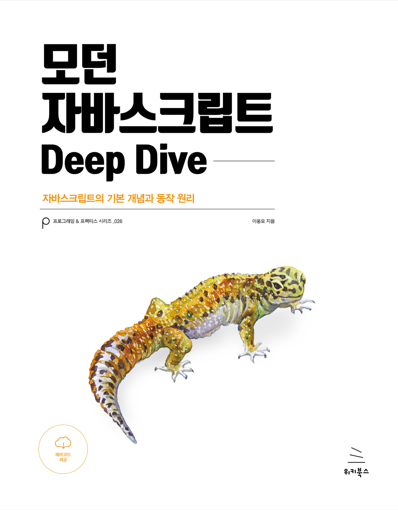

# 모던 자바스크립트 스터디

## 참여자

|       |   |  |  |  |
|:------------------------------------------------:|:--------------------------------------------:|:---------------------------------------------:|:--------------------------------------------:|:--------------------------------------------:|
|         [김동률](https://github.com/doctork4)         |       [이현우](https://github.com/hyunwlee-dev)       |      [강예슬](https://github.com/yheseul)       |      [정연준](https://github.com/Chadolbaegi128)       |      [홍서진](https://github.com/lucia0929)       |

## 스터디 전 준비 사항
- 책 읽기
- 회차 폴더 안에 {이름}.md 파일 안에 공유할 내용 정리하기
- 공부한 내용 정리
- 질문(면접 질문 느낌)
- 토론 주제 적어오기
- 인상 깊은 점
- 새로 알게된 개념